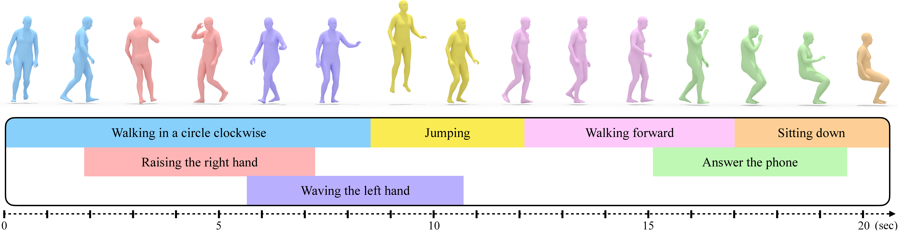

<div align="center">

# STMC: Spatio-Temporal Motion Collage

<a href="https://mathis.petrovich.fr"><strong>Mathis Petrovich</strong></a>
·
<a href="https://orlitany.github.io"><strong>Or Litany</strong></a>
·
<a href="https://www.umariqbal.info"><strong>Umar Iqbal</strong></a>
·
<a href="https://ps.is.mpg.de/~black"><strong>Michael J. Black</strong></a>
·
<a href="https://imagine.enpc.fr/~varolg"><strong>G&#252;l Varol</strong></a>
·
<a href="https://xbpeng.github.io"><strong>Xue Bin Peng</strong></a>
·
<a href="https://davrempe.github.io"><nobr>Davis Rempe</nobr></a>


[](https://humogen.github.io)
[](https://arxiv.org/abs/2401.08559)
[](https://github.com/nv-tlabs/stmc/blob/main/LICENSE)


</div>

## Description
This repository hosts the official PyTorch implementation of the paper **"Multi-Track Timeline Control for Text-Driven 3D Human Motion Generation"** ([CVPRW 2024](https://arxiv.org/abs/2401.08559)). For more details, please visit our [**project webpage**](https://mathis.petrovich.fr/stmc).



### Bibtex
If you use our code in your research, kindly cite our work:

```bibtex
@inproceedings{petrovich24stmc,
    title     = {Multi-Track Timeline Control for Text-Driven 3D Human Motion Generation},
    author    = {Petrovich, Mathis and Litany, Or and Iqbal, Umar and Black, Michael J. and Varol, G{\"u}l and Peng, Xue Bin and Rempe, Davis},
    booktitle = {CVPR Workshop on Human Motion Generation},
    year      = {2024}
}
```

### Timelines

A timeline is represented as a list of text intervals, one for each lines, as follow:
```
walking in a circle # 0.0 # 6.0 # legs
raising both hands in the air # 2.0 # 5.0 # right arm # left arm
```

Each text interval contains several pieces of information separated by #:
- text description
- start time (in seconds)
- end time (in seconds)
- list of body parts

In this code, we assume that we know the body parts, but we could also use GPT-3 (as in SINC) or learn a model to label them automatically.

## Spatio-Temporal Motion Collage (STMC)

Key components of the STMC algorithm are located in ``src/stmc.py``, with additional functions in ``src/bptools.py``. The algorithm includes:
- ``read_timelines``: Reads and parses timelines from a file.
- ``process_timeline``: Preprocesses timelines as described in the paper.
- ``combine_features_intervals``: Spatially and temporally combines motions (at each denoising step).

STMC is designed for integration with existing diffusion models.

## MDM-SMPL

In addition to the STMC algorithm, we also provide a fast diffusion model that directly generates the SMPL pose parameters.

### Installation :construction_worker:
Clone and set up the environment as follows:

```bash
git clone https://github.com/nv-tlabs/stmc
cd stmc/
```

This code was tested with python 3.10.12, cuda 12.1 and pytorch "2.0.1+cu118".

Creation of the environnement:
```bash
# create a virtual environnement (also works with conda)
python -m venv ~/.venv/STMC
# activate the virtual environnement
source ~/.venv/STMC/bin/activate
# upgrade pip
python -m pip install --upgrade pip
# Install pytorch (see https://pytorch.org/get-started/locally)
python -m pip install torch torchvision --index-url https://download.pytorch.org/whl/cu118
# Install missing packages
python -m pip install -r requirements.txt
```

If it does not work well on Ubuntu, you can try installing this package:
```bash
sudo apt-get install python3.10-venv
```

### Dataset setup
Follow the instructions below to set up the datasets within the ``stmc`` directory.

```
mkdir datasets
```

#### SMPL dependency
Please follow the [README from TEMOS](https://github.com/Mathux/TEMOS?tab=readme-ov-file#4-optional-smpl-body-model) to obtain the ``deps`` folder with SMPL+H downloaded, and place ``deps`` in the ``stmc`` directory.

#### Motions

<details><summary>Click to expand</summary>

The motions all come from the AMASS dataset. Please download all "SMPL-H G" motions from the [AMASS website](https://amass.is.tue.mpg.de/download.php) and place them in the folder ``datasets/motions/AMASS``.

<details><summary>It should look like this:</summary>

```bash
datasets/motions/
└── AMASS
    ├── ACCAD
    ├── BioMotionLab_NTroje
    ├── BMLhandball
    ├── BMLmovi
    ├── CMU
    ├── DanceDB
    ├── DFaust_67
    ├── EKUT
    ├── Eyes_Japan_Dataset
    ├── HumanEva
    ├── KIT
    ├── MPI_HDM05
    ├── MPI_Limits
    ├── MPI_mosh
    ├── SFU
    ├── SSM_synced
    ├── TCD_handMocap
    ├── TotalCapture
    └── Transitions_mocap
```

Each file contains a "poses" field with 156 (52x3) parameters (1x3 for global orientation, 21x3 for the whole body, 15x3 for the right hand and 15x3 for the left hand).

</details>

Then, launch these commands:

```bash
python prepare/amasstools/fix_fps.py
python prepare/amasstools/smpl_mirroring.py
python prepare/amasstools/extract_joints.py
python prepare/amasstools/get_smplrifke.py
```

<details><summary>Click here for more information on these commands</summary>

#### Fix FPS

The script will interpolate the SMPL pose parameters and translation to obtain a constant FPS (=20.0). It will also remove the hand pose parameters, as they are not captured for most AMASS sequences. The SMPL pose parameters now have 66 (22x3) parameters (1x3 for global orientation and 21x3 for full body). It will create and save all the files in the folder ``datasets/motions/AMASS_20.0_fps_nh``.


#### SMPL mirroring

This command will mirror SMPL pose parameters and translations, to enable data augmentation with SMPL (as done by the authors of HumanML3D with joint positions).
The mirrored motions will be saved in ``datasets/motions/AMASS_20.0_fps_nh/M`` and will have a structure similar than the enclosing folder.


#### Extract joints

The script extracts the joint positions from the SMPL pose parameters with the SMPL layer (24x3=72 parameters). It will save the joints in .npy format in this folder: ``datasets/motions/AMASS_20.0_fps_nh_smpljoints_neutral_nobetas``.


#### Get SMPL RIFKE

This command will use the joints + SMPL pose parameters (in 6D format) to create a unified representation (205 features). Please see ``prepare/amasstools/smplrifke_feats.py`` for more details.

</details>

The dataset folder should look like this:
```bash
datasets/motions
├── AMASS
├── AMASS_20.0_fps_nh
├── AMASS_20.0_fps_nh_smpljoints_neutral_nobetas
└── AMASS_20.0_fps_nh_smplrifke
```

</details>


#### Texts

<details><summary>Click to expand</summary>

In the stmc directory, clone the [TMR repo](https://github.com/Mathux/TMR): ``git clone https://github.com/Mathux/TMR.git``.
It will also be useful for evaluation purposes.

Run this command to copy the processed HumanML3D text annotations. This allows us to use the HumanML3D annotations with the original AMASS sequences, as explained in the [AMASS-Annotation-Unifier repo](https://github.com/Mathux/AMASS-Annotation-Unifier).

```bash
cp -r TMR/datasets/annotations datasets/
```

Next, run the following command to pre-compute the CLIP embeddings (ViT-B/32):

```bash
python -m prepare.embeddings
```

The folder should look like this:

```
datasets/annotations/humanml3d
├── annotations.json
├── splits
│   ├── all.txt
│   ├── test_tiny.txt
│   ├── test.txt
│   ├── train_tiny.txt
│   ├── train.txt
│   ├── val_tiny.txt
│   └── val.txt
└── text_embeddings
    └── ViT-B
        ├── 32_index.json
        ├── 32.npy
        └── 32_slice.npy
```

</details>

### Training :rocket:

Start the training process with:

```bash
python train.py
```

It will launch a training on ``humanml3d`` with the ``clip`` embeddings and with the ``smplrifke`` representation. It will save the outputs to the folder ``outputs/mdm-smpl_clip_smplrifke_humanml3d`` which we will refer to ``RUN_DIR``.

## Pretrained model :dvd:

Please run this command to download the pre-trained model:
```bash
bash prepare/download_pretrain_models.sh
```

The model will be downloaded and saved in ``pretrained_models/mdm-smpl_clip_smplrifke_humanml3d``.

<details><summary> If the download does not start ("Access denied" with gdown) </summary>

You can either:
- Click on [this link](https://drive.usercontent.google.com/download?id=1CNXnqxGcVHDYzjrfZOlBge7A54OfCt2d) and download from your web browser
- Follow this [stackoverflow](https://stackoverflow.com/a/67550427) answer, by creating a Google token and run the command:
```bash
curl -H "Authorization: Bearer YOUR_ACCESS_TOKEN" "https://www.googleapis.com/drive/v3/files/1CNXnqxGcVHDYzjrfZOlBge7A54OfCt2d?alt=media" -o pretrained_models.tgz
```

Then, you can extract the pretrain model by using this command:

```bash
bash prepare/extract_pretrain_models.sh
```

</details>

## Generate

Generate a 3D human motion from a timeline using the following command:

```bash
python generate.py run_dir=RUN_DIR timeline=PATH
```
with ``PATH`` the path to the timeline file (for example ``timelines/walking_circle_raising_arms.txt``).

You can use ``device=cpu`` if you don't have a gpu.

## Demo

Launch a demo to generate motions from timelines with the following command:

```bash
python app.py
```

The parameters can be changed in ``app_config.py``. It takes the pretrained model by default.

## MTT (Multi-Track Timelines) dataset

The MTT dataset can be found in its entirety in the file ``mtt/MTT.txt``, or file by file in this folder ``mtt/MTT/``.

<details><summary>Click to expand</summary>

It is based on the list of text prompts in the file ``mtt/texts.txt`` (which corresponds to this list of motions in AMASS ``mtt/motions.txt``). Sampling is done by this ``mtt/sampling_timelines.py`` file (and ``mtt/timelines_to_mtt.py``) but you don't need to run them again.

</details>

### Generate MTT

You can use this script to generate joints for all the timelines in the MTT dataset. It is required for the evaluation below.

```bash
python generate_mtt.py run_dir=RUN_DIR [value_from=XX]
```

The parameter ``value_from`` is optional, it can be set to:
- ``joints`` (by default): to extract the joints directly from the representation
- ``smpl``: to extract SMPL pose parameters from the representation and use the SMPL layer to obtain the joints

## Integration with pre-trained diffusion model

STMC can also be used in a pre-existing diffusion model, provided that it operates on the "motion space" (no latent diffusion).

### Integration with MDM

<details><summary>Click to expand</summary>

Please follow the MDM installation instructions in their [repo](https://github.com/GuyTevet/motion-diffusion-model), and go to the repo folder:

```bash
cd /path/to/motion-diffusion-model
```

This code has been tested on commit ``8139dda55d90a58aa5a257ebf159b2ecfb78c632``. To check the current commit, you can run ``git rev-parse HEAD`` (or run ``git log``). Copy the additional files into the MDM code:

```bash
cp -r /path/to/stmc/integration/stmc_mdm .
cp -r /path/to/stmc/mtt .
```

Download the pre-trained ``humanml_trans_enc_512`` model from the README.
The following commands take this model by default ``--model_path=./save/humanml_trans_enc_512/model000200000.pt``, but it can be changed to another as long as it is trained on Humanml3D.

#### Generate

To generate a motion from a timeline, you can run this command:

```bash
python -m stmc_mdm.generate --input_timeline PATH
```

This script behaves in the same way as MDM, and creates a folder in which the results are stored (visualisation + ``.npy'').

#### Generate MTT

To generate joints from all the timelines in the MTT dataset (required for evaluation), you can run this command:

```bash
python -m stmc_mdm.generate_mtt
```

It will create a folder with all the joints stored in ``.npy'' format.
Note that the joints generated have the axis of gravity in Y (and not in Z as in Ours). This difference is handled in the evaluation script.

</details>

### Integration with MotionDiffuse

<details><summary>Click to expand</summary>

Please follow the MotionDiffuse installation instructions in their [repo](https://github.com/mingyuan-zhang/MotionDiffuse), and go to the "text2motion" folder in their repo folder:

```bash
cd /path/to/MotionDiffuse/text2motion
```

This code has been tested on commit `aba848edd22133919ca96b67f4908399c67685b1`. To check the current commit, you can run ``git rev-parse HEAD`` (or run ``git log``). Copy the additional files into the MotionDiffuse code:

```bash
cp -r /path/to/stmc/integration/stmc_motiondiffuse .
cp -r /path/to/stmc/mtt .
```

Download the pre-trained ``t2m_motiondiffuse`` model from the README.
The following commands take this model as the default ``--opt_path checkpoints/t2m/t2m_motiondiffuse/opt.txt``, but it can be changed to another provided it is trained on Humanml3D.


#### Generate

To generate a motion from a timeline (stored in the ``PATH'' folder), you can run this command:

```bash
PYTHONPATH="$(dirname $0)/..":$PYTHONPATH python -u stmc_motiondiffuse/generate.py --input_timeline PATH --result_path "motion.mp4" --npy_path "joints.npy"
```

This script behaves in a similar way to MotionDiffuse, storing the visualisation + joints in ``.npy''.

#### Generate MTT

To generate joints from all the timelines in the MTT dataset (required for evaluation), you can run this command:

```bash
PYTHONPATH="$(dirname $0)/..":$PYTHONPATH python -u stmc_motiondiffuse/generate_mtt.py
```

It will create a folder with all the joints stored in ``.npy'' format.
Note that the joints generated have the axis of gravity in Y (and not in Z as in Ours). This difference is handled in the evaluation script.

</details>

## Baselines

<details><summary>Click to expand</summary>

We present in the paper 3 (+1) baselines.
- ``One Text``: collapse the multi-track timeline into a single text (A then B while C)
- ``Single track``: collapse the multi-track timeline into a single track (with while) (corresponds to the ``DiffCollage`` method)
- ``SINC``: only combine the motions at the end of the generation
- ``SINC lerp``: same as SINC with linear interpolation to smooth the transitions

### Implementation

For the baselines ``One Text`` and ``Single track``, it is implemented by pre-processing the timelines (see the ``mtt/create_baselines.py`` script).
The timelines are already pre-processed in this repo in the folder: ``mtt/baselines``. Then, it is possible to use the STMC algorithm directly on these timelines.

For the SINC baselines, we need to do the standard diffusion process for the generation, and merge the motions by body parts at the end (and do linear interpolation if needed). There is a special method called ``sinc_baseline`` in the diffusion object to handle this.

For SINC baselines, we need to do the standard diffusion process for generation, and merge the motions by body parts at the end (+ linear interpolation for lerp). There is a special method called ``sinc_baseline`` to handle this in this model.

### Generation

To generate the motions with the baseline methods on the MTT dataset, you can add a parameter to the ``generate_mtt`` script:

```bash
python generate_mtt.py run_dir=RUN_DIR baseline=XX
```

with ``XX`` which corresponds to:
- ``none`` by default (for STMC)
- ``onetext``
- ``singletrack``
- ``sinc``
- ``sinc_lerp``

For MDM and MotionDiffuse, you should add ``--stmc_baseline=XX``.

</details>

## Evaluation :bar_chart:

### TMR setup

You should already have TMR installed in this repo (used for dataset installation). Follow their [**README**](https://github.com/Mathux/TMR) and configure the TMR code (download the pre-trained models). Then copy these folders and files:

```bash
cd /path/to/stmc
cp -r mtt TMR/
cp mtt/motion_representation_local.py TMR/src/guofeats/
```

### Evaluation

The ``mtt/experiments.py`` file contains all the experiments in Table 1 of the paper. Feel free to assign the ``experiments`` variable to the list of only the generations you wish to evaluate. Then run this command to obtain the metrics (in LaTeX format):

```bash
cd TMR/
python -m mtt.eval_mtt
```

## License :books:
This code, the MTT dataset, and pre-trained models are distributed under [this non-commercial license](LICENSE). Models are trained using AMASS and HumanML3D data, which have their own respective licenses that must be followed:
* AMASS [[license](https://github.com/nghorbani/amass/blob/master/LICENSE.txt)]
* HumanML3D [[license](https://github.com/EricGuo5513/HumanML3D/blob/main/LICENSE)]

Parts of this codebase are based on other repos including:
* TEMOS [[license](https://github.com/Mathux/TEMOS/blob/master/LICENSE)]
* TMR [[license](https://github.com/Mathux/TMR/blob/master/LICENSE)]
* Complex Text2Animation [[license](https://github.com/anindita127/Complextext2animation/blob/main/LICENSE)]
* PyTorch3D [[license](https://github.com/facebookresearch/pytorch3d/blob/main/LICENSE)]
* Pytorch Lightning [[license](https://github.com/Lightning-AI/pytorch-lightning/blob/master/LICENSE)]
* PARE [[license](https://github.com/mkocabas/PARE/blob/master/LICENSE)]
* SMPL-X [[license](https://github.com/vchoutas/smplx/blob/main/LICENSE)]
